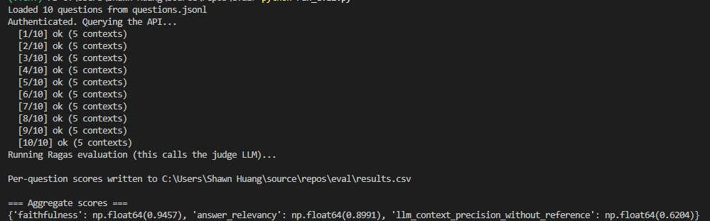
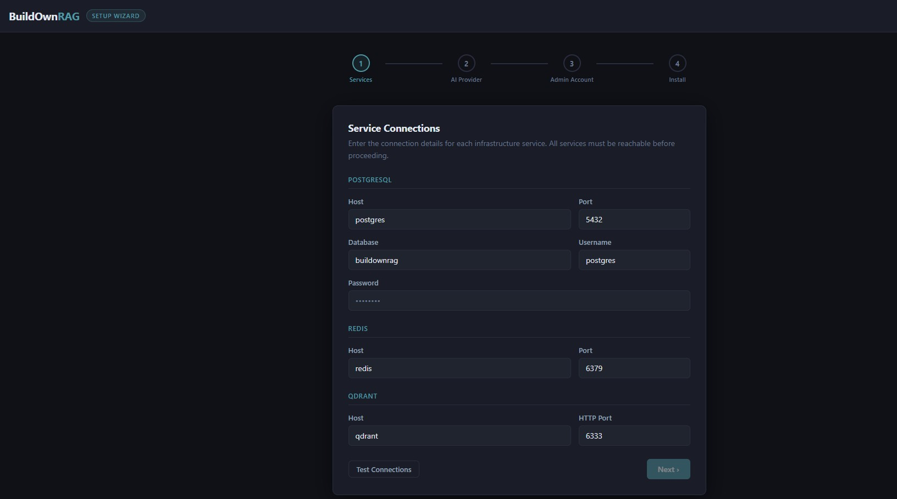
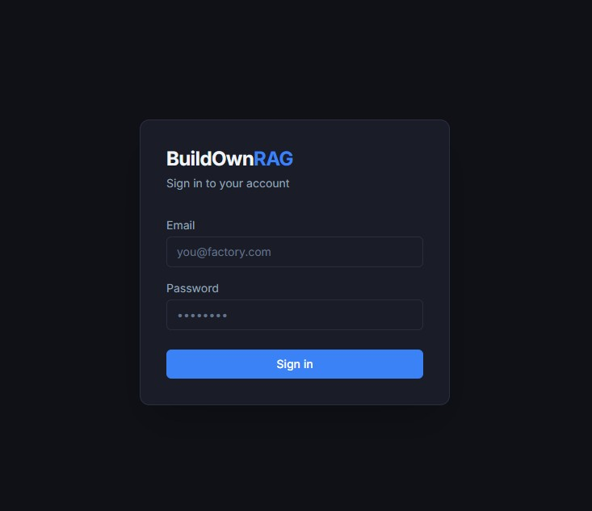

# BuildOwnRAG

A self-hostable, multi-tenant RAG (Retrieval-Augmented Generation) knowledge platform for
manufacturing. It ingests SOPs, BOMs, and technical documents, then answers questions with
cited sources. It runs entirely inside a factory network via Docker, and supports multiple
LLM/embedding providers (OpenAI, Azure OpenAI, Google Gemini, Ollama, Groq, Anthropic Claude).

---

## RAGAS Score

Answer quality is evaluated with [RAGAS](https://docs.ragas.io/) against a 10-question test set
queried through the live API (5 retrieved contexts per question).



| Metric | Score |
|---|---|
| Faithfulness | 0.9457 |
| Answer Relevancy | 0.8991 |
| Context Precision (LLM, without reference) | 0.6204 |

Evaluation conditions:

- LLM: `gemini-2.5-flash`
- Embedding model: `gemini-embedding-001`
- Retrieval: Hybrid mode (Qdrant vector search + BM25 + RRF), TopK = 5

---

## Highlights

- Two retrieval modes, selectable per tenant:
  - Hybrid (default): Qdrant vector search + Lucene BM25 + Reciprocal Rank Fusion.
  - Lite: BM25-only over PostgreSQL, no embedding model and no Qdrant required.
- Pluggable LLM and embedding providers, switchable at runtime from the UI.
- File ingestion for PDF, Word, Excel, CSV, plain text, Markdown, and HTML.
- Background ingestion via Hangfire and a Redis Stream queue; incremental sync by content hash.
- Per-tenant isolation of documents, users, query logs, and vector collections.

---

## Project Status

This section is intentionally explicit so the repository does not overstate what currently works.

### Done (implemented and working)

- [x] Hybrid and Lite retrieval pipelines
- [x] Multi-provider LLM/embedding routing (OpenAI, Azure OpenAI, Gemini, Ollama, Groq, Claude)
- [x] Document upload and ingestion for PDF, Word, Excel, CSV, plain text, Markdown, and HTML
- [x] Folder connector with incremental (content-hash) sync and optional file-watching
- [x] Google Drive connector (service account) with incremental sync via the Drive changes API and per-connector scheduling
- [x] SharePoint connector (Entra app) with incremental sync via the Microsoft Graph delta API
- [x] Confluence connector (Cloud API token or Server/Data Center PAT) with incremental sync via CQL `lastmodified` queries; scope by spaces and/or page trees (a page plus all its descendants); pages are ingested as HTML and attachments (PDF/Word/Excel/…) optionally included
- [x] JWT auth, per-tenant isolation, query logging, and Redis caching
- [x] First-run setup wizard and Docker Compose deployment
- [x] Cosine reranker (default); Cohere reranker optional (needs API key, falls back to cosine)
- [x] Analytics dashboard UI, The analytics backend is implemented, but the frontend dashboard page is still missing.

## TODO

- [ ] Remaining connectors  
  Arena is scaffolded only and is not functional yet.
- [ ] Production observability  
  Production-grade observability is not in place yet. Prometheus, Grafana, and Loki still need to be integrated; currently only the Aspire dashboard is available for development-time diagnostics.
- [ ] Broader test coverage  
  Additional automated test coverage is still needed, including frontend integration tests, end-to-end scenarios, regression coverage, and larger-scale validation.

---

## Tech Stack

| Layer            | Technology                                                        |
| ---------------- | ----------------------------------------------------------------- |
| Backend          | ASP.NET Core, .NET 8, C#                                          |
| Database         | PostgreSQL 16 (EF Core)                                           |
| Vector store     | Qdrant                                                            |
| Cache / queue    | Redis 7 (cache, session, ingest stream)                          |
| Background jobs  | Hangfire (PostgreSQL storage)                                    |
| Keyword search   | Lucene.NET (BM25, in-memory index)                               |
| Chunking         | Tiktoken token counting                                          |
| LLM providers    | OpenAI / Azure OpenAI / Google Gemini / Ollama / Groq / Claude   |
| Frontend         | React 18 + Vite + TypeScript + TanStack Query + Zustand          |
| Deployment       | Docker Compose                                                    |

---

## Project Layout

```
ManufacturingAI/
  src/
    ManufacturingAI.Core/             Domain models, interfaces, configuration
    ManufacturingAI.Core.RAG/         Chunking, retrieval (Hybrid + Lite), reranking
    ManufacturingAI.Core.Parser/      File parsers: PDF / Word / Excel / CSV / TXT / Markdown / HTML (heading-aware)
    ManufacturingAI.Core.Connectors/  Connector abstractions
    ManufacturingAI.Infrastructure/   EF Core + PostgreSQL, Qdrant, Redis, LLM/Embedding providers
    ManufacturingAI.API/              ASP.NET Core Web API (port 8080)
    ManufacturingAI.Setup/            First-run install wizard (port 8081)
    ManufacturingAI.Frontend/         React factory UI (dev 5173 / docker 3000)
    ManufacturingAI.Services.Ingest/  Ingestion service and Hangfire jobs
    ManufacturingAI.Services.Query/    QueryRouter, QueryService, LiteQueryService
    ManufacturingAI.Services.Analytics/ Tenant analytics
    ManufacturingAI.Services.TestGen/   Test-script generation
    ManufacturingAI.Connectors.*/     Folder, SharePoint, Confluence, GoogleDrive, Arena
  docker/                             Dockerfiles (api, setup, frontend, nginx)
  docker-compose.yml                  Local/dev stack (builds from source)
  ManufacturingAI.slnx                Solution file
```

---

## Getting Started

### Prerequisites

- Docker Desktop
- .NET 8 SDK (only for local, non-Docker development)
- Node.js 18+ (only for frontend development)

### Run with Docker Compose

```
docker compose up -d
```

Default service ports:

| Service  | Port      | Purpose                                      |
| -------- | --------- | -------------------------------------------- |
| app      | 8080      | Main API                                     |
| frontend | 3000      | React UI (nginx proxies /api to app:8080)    |
| setup    | 8081      | Install wizard (enable with --profile setup) |
| postgres | 5432      | Tenant database                              |
| redis    | 6379      | Cache, session, ingest queue                 |
| qdrant   | 6333/6334 | Vector database                              |

On first start the API waits for PostgreSQL, applies EF Core migrations, ensures the Qdrant
collection exists, and seeds a default tenant and admin user. The startup banner prints the
admin email and password. Open http://localhost:3000 to sign in.

### Setup wizard

For a guided first-time install, start with the setup profile and open http://localhost:8081:

```
docker compose --profile setup up -d
```

The wizard walks through four short steps — Services, AI Provider, Admin Account, Install.
Service connection fields are pre-filled with the Docker Compose defaults, so a standard
install is just "Test Connections" and Next:



When the wizard finishes, the stack is ready and you can sign in at http://localhost:3000:



### Local development (without Docker)

```
# API
dotnet run --project src/ManufacturingAI.API

# Frontend
cd src/ManufacturingAI.Frontend
npm install
npm run dev
```

---

## Architecture

The system is built from two independent pipelines that share the same per-tenant data.

- Ingestion pipeline: Document -> Parse -> Chunk -> (Embed -> Qdrant) -> PostgreSQL.
  Runs in the background.
- Query pipeline: Question -> Retrieve -> (Rerank) -> LLM -> answer with citations.
  Runs online, in real time.

Each tenant has its own Qdrant collection named `tenant_{tenantId}`, keyed on the embedding
dimension. Chunk text and metadata always live in PostgreSQL; Qdrant only stores vectors and a
`VectorId` that links a vector back to its PostgreSQL chunk. BM25 and prompt assembly both read
the raw text from PostgreSQL.

---

## Ingestion Pipeline

Entry point: `src/ManufacturingAI.Services.Ingest/IngestService.cs`

Sources:
- User upload -> `DocumentsController` -> `IngestUploadedFileAsync` creates a `Pending` document,
  then enqueues a Hangfire job (`UploadIngestJob`).
- Connector sync -> folder watcher / scheduler -> Redis Stream queue -> `IngestWorker`.

Core indexing flow (`IngestDocumentAsync`):

```
1.  Compute VersionHash (SHA-256 of content).
2.  Compare against SyncState. Same hash + Completed -> skip (incremental sync dedup).
3.  Mark SyncState = Running.
4.  ParserFactory.ParseAsync(mimeType): pick a parser by MIME
    (PDF / Word / Excel / CSV / TXT / Markdown / HTML) and produce a ParsedDocument.
    Markdown is parsed heading-aware: each ATX heading starts a section with a
    breadcrumb title (Parent > Child); fenced code blocks are preserved verbatim.
5.  SemanticChunker.Chunk(): section-first split, Tiktoken token counting,
    defaults MaxTokens=512 and Overlap=50, sentence-boundary splitting for long sections.
6.  Save or update the Document (Status = Processing).

    Retrieval-mode branch:
      - Lite mode: skip steps 7-9 entirely (no embedding, no Qdrant).
      - Hybrid mode:
        7. Batch-embed the chunks (provider chosen by EmbeddingProviderRouter).
        8. EnsureDimensionsCompatibleAsync: create the collection on first ingest,
           reuse if the dimension is unchanged, or enqueue a rebuild if it changed.
        9. Upsert vectors into Qdrant (payload: documentId / tenantId / chunkIndex / sourceType).
           On re-index, the old vectors for the document are deleted first.

10. Write DocumentChunk rows to PostgreSQL (old chunks deleted first). In Lite mode
    VectorId is left empty; in Hybrid mode it maps to the Qdrant point.
11. Document.Status = Indexed, SyncState = Completed, invalidate the document-list cache.
    On failure: SyncState = Failed and Document.Status = Failed, with the error recorded.
```

Deleting a document removes its Qdrant vectors, its DocumentChunk rows, and its SyncState
bookkeeping, so re-uploading the same file is treated as a fresh ingest rather than being
skipped by the version-hash dedup.

---

## Query Pipeline

Entry point: `src/ManufacturingAI.API/Controllers/QueryController.cs` -> `IQueryService = QueryRouter`.

`QueryRouter` reads the tenant's `RetrievalMode` and dispatches to the matching pipeline.

### Hybrid mode (default)

Orchestrator: `src/ManufacturingAI.Core.RAG/Orchestration/QueryOrchestrator.cs`

```
1.  SHA-256 of the question -> look up the Redis result cache. Hit -> return immediately.
2.  HybridRetriever.RetrieveAsync (see below) -> candidate chunks.
3.  RerankerFactory picks a reranker (cosine by default), output TopK = 5.
4.  Build the context block from the selected chunks (tagged with title / section / page).
5.  Apply the system prompt (answer only from the provided excerpts, never fabricate).
6.  LLMService.CompleteAsync (Temperature = 0.3, MaxTokens = 2048). A streaming variant exists.
7.  Compute a confidence score = top FusionScore * 0.7 + min(answer length / 500, 1.0) * 0.3.
8.  If confidence < 0.4, append a "verify against the original document" warning.
9.  Build the source citations (title / type / page / excerpt).
10. Write the result to the Redis cache (TTL 30 minutes).
11. Persist a QueryLog row to PostgreSQL (feeds analytics).
```

Hybrid retrieval (`src/ManufacturingAI.Core.RAG/Retrieval/HybridRetriever.cs`):

```
1. Embed the query (also yields the vector dimension).
2. Confirm the tenant collection exists with a matching dimension.
3. Qdrant vector search, fetching TopK * 2 candidates, filtered by tenantId.
4. Load the candidate chunk text from PostgreSQL.
5. BM25 scoring over the candidates (Lucene.NET in-memory index).
6. Reciprocal Rank Fusion (k = 60): FusionScore = 1/(60 + vectorRank) + 1/(60 + bm25Rank).
7. Sort by FusionScore, take TopK.
```

A Hybrid query makes exactly two external API calls: one embedding call and one LLM call.

### Lite mode (BM25-only)

Code: `src/ManufacturingAI.Core.RAG/Retrieval/LiteRetriever.cs` and
`src/ManufacturingAI.Services.Query/LiteQueryService.cs`

A lightweight pipeline that needs no embedding model and no Qdrant. It is useful for providers
without embeddings (such as Groq), or for keyword-heavy document sets.

```
1. SQL keyword prefilter (DocumentChunkRepository.SearchByKeywordAsync):
   tokenize the query, then ILIKE over chunk Content (tenant-scoped), capped at PrefilterLimit.
   The tokenizer is CJK-aware: Latin terms become whole words (length >= 2), while Chinese and
   Japanese text becomes overlapping bigrams, because such text has no whitespace word boundaries.
2. In-memory BM25 over the candidates (Lucene.NET), take TopK.
3. LLMService.CompleteAsync answers only from the selected chunks (a streaming variant exists).
```

A Lite query makes exactly one external API call (the LLM). Tunables live under
`LiteMode` in `appsettings.json` (`TopK`, `PrefilterLimit`).

### Mode comparison

| Aspect          | Lite mode                                     | Hybrid mode (default)                      |
| --------------- | --------------------------------------------- | ------------------------------------------ |
| Ingest          | parse -> chunk -> PostgreSQL                   | parse -> chunk -> embed -> Qdrant + PostgreSQL |
| Query           | ILIKE prefilter -> BM25 -> LLM                 | Qdrant + BM25 + RRF -> rerank -> LLM        |
| External calls  | ingest 0, query 1 (LLM)                       | ingest 1 (embed), query 2 (embed + LLM)    |
| Needs embedding | no                                            | yes                                        |
| Needs Qdrant    | no                                            | yes                                        |

---

## AI Providers

Provider selection is per tenant and applied at runtime from Settings -> AI Model.
`LlmProviderRouter` and `EmbeddingProviderRouter` resolve the configured implementation on each call.

| Provider     | Default chat model        | Embedding                                  |
| ------------ | ------------------------- | ------------------------------------------ |
| OpenAI       | gpt-4o-mini               | text-embedding-3-small (1536)              |
| Azure OpenAI | custom deployment         | text-embedding-3-small (1536)              |
| Google Gemini| gemini-2.0-flash          | text-embedding-004 (768)                   |
| Ollama       | qwen2.5                   | nomic-embed-text (768)                     |
| Groq         | llama-3.3-70b-versatile   | none (choose a separate embedding provider)|
| Claude       | claude-sonnet-4-6         | none (choose a separate embedding provider)|

Notes:
- In Hybrid mode the LLM and embedding providers must produce a consistent vector space.
  Changing the embedding dimension requires rebuilding the tenant's Qdrant collection and
  re-indexing every document.
- Groq and Claude have no native embeddings. In Hybrid mode, select a separate embedding
  provider (for example OpenAI or Gemini). Alternatively use Lite mode, which needs no
  embeddings at all.

---

## Configuration

Key settings in `src/ManufacturingAI.API/appsettings.json` (override with environment variables):

| Key                          | Purpose                                       |
| ---------------------------- | --------------------------------------------- |
| ConnectionStrings:Postgres   | PostgreSQL connection string                  |
| ConnectionStrings:Redis      | Redis connection string                       |
| Qdrant:Host / Qdrant:Port    | Qdrant gRPC endpoint                          |
| Llm:Provider / Llm:Model     | Default LLM provider and model                |
| Embedding:Provider           | Default embedding provider                    |
| LiteMode:TopK                | Chunks passed to the LLM in Lite mode         |
| LiteMode:PrefilterLimit      | Max candidate chunks before BM25 ranking      |
| Jwt:Secret / Issuer / Audience | JWT signing and validation                  |
| Encryption:Key / IV          | AES key/IV for encrypted connector settings   |

Secrets are read from the environment in production; never commit real keys. The committed
`appsettings.json` contains placeholders only.
